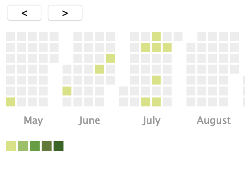

# amazon-orders-collage

Creates a collage (grid) of product images for each product in an amazon.com order history report.  

## Why?
I thought it would be interesting to make a "consumer yearbook" of sorts showing a year's worth of Amazon activity.  It's nostalgic and #mildlyinteresting.

## How to use

- Clone this repo
- Install Dependencies `npm install`
- Generate an [order history report](https://www.amazon.com/gp/b2b/reports) from your Amazon account
- Save your order history report CSV to your computer

- Download product images
  - `node get-photos.js /path/to/your/order-history-report.csv`
  - product images will be saved in `product_images/`

- Assemble your collage!
  - `node assemble-collage`
  - Your collage will be saved in `output/amazon-collage.jpg`
  - An HTML grid version of your collage will be saved in `output/index.html`

- Build Heatmap
  - `npm run build` will ask you for path of Amazon CSV file. Put assets in `output` folder
  - `npm run serve` will serve the contents in `output`

## Customizing Dimensions

You can customize the following layout properties in `assemble-collage.js`:

- `gridWidth` - the number of columns in the collage
- `cellPadding` - the padding around each product image (pixels)
- `imageDimension` - the dimensions (square) of the product images
- `outputPadding` - the padding around the outside of the collage (pixels)

## How it works

`get-photos.js` parses the csv, pulling the `ASIN/ISBN` value for each product.  It then GETs the product's page from amazon.com, parses the html with cheerio, grabs the first product image and saves it in `product_images/`

`assemble-collage.js` puts the images together into an web page with a strict grid layout, loads it in a headless browser, and saves an image.

## Contributors

- [Chris Whong](https://github.com/chriswhong)
- [Aidan Feldman](https://github.com/afeld)
- [Loisaida Sam Sandberg](https://github.com/loisaidasam)
